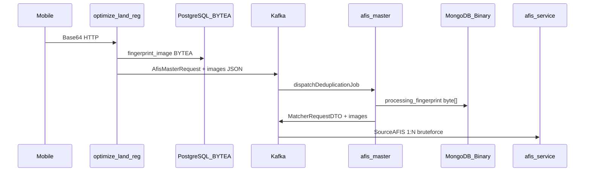
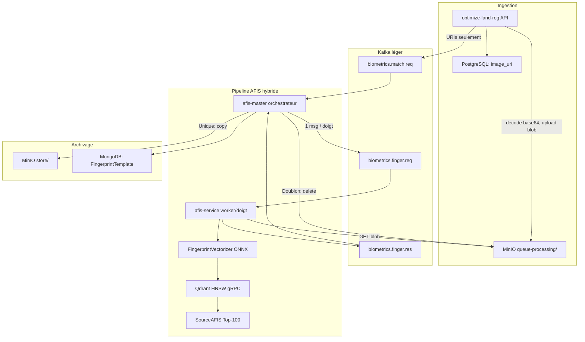
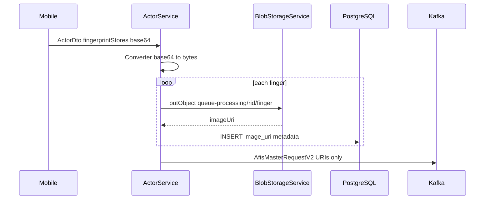
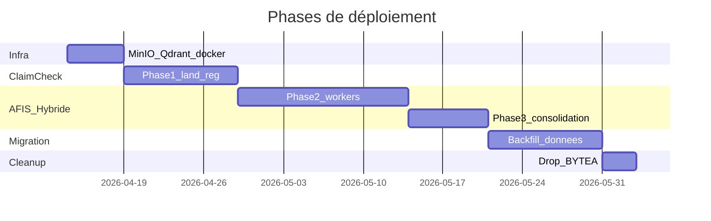

# Plan de migration architecturale MinIO + AFIS Vector Search

## Contexte et diagnostic

### État actuel (code réel)

Le pipeline actuel est **100 % inline** : les images circulent en `byte[]` / base64 de bout en bout.



**Points de friction identifiés :**

| Composant | Fichier clé | Problème |
|-----------|-------------|----------|
| Ingestion API | [`ActorService.java`](optimize-land-reg/src/main/java/com/optimize/land/service/ActorService.java) | Décode base64 → `byte[]` → PostgreSQL |
| Kafka producer | [`AfisProducer.java`](optimize-land-reg/src/main/java/com/optimize/land/jms/AfisProducer.java) | Sérialise l'entité JPA complète avec images |
| Orchestrateur | [`MasterMatcherService.java`](afis-master/src/main/java/com/optimize/kopesa/afis/master/service/MasterMatcherService.java) | Re-propage images dans `MatcherRequestDTO`, batch 18k |
| Worker | [`MatcherService.java`](afis-service/src/main/java/com/optimize/kopesa/afis/service/service/MatcherService.java) | Charge candidats MongoDB `byte[]`, compare SourceAFIS en masse |
| Stockage | `fingerprint_image BYTEA` / BSON Binary | Pas d'URI, pas d'object storage |

**Absent du code (présent uniquement dans** [`architecture-afis.md`](_bmad-output/planning-artifacts/architecture-afis.md) **et** [`epics-afis.md`](_bmad-output/planning-artifacts/epics-afis.md)**) :** MinIO, Qdrant, ONNX Runtime, pattern Claim-Check, topics Kafka allégés.

### État cible (artefacts + votre intention)



**Principe directeur :** le base64 n'existe qu'à la frontière HTTP mobile → API. Tout le reste manipule des **URIs S3** et des **streams binaires locaux éphémères** (téléchargés depuis MinIO, purgés après traitement — NFR-SEC-1).

---

## Décisions architecturales verrouillées

| Décision | Choix | Justification |
|----------|-------|---------------|
| Pattern de transit | **Claim-Check** (Enterprise Integration Patterns) | Réduit messages Kafka de ~50-200 Ko/doigt à ~200 octets/URI |
| Object storage | **MinIO** (API S3-compatible) | Air-gap/VPC, buckets `queue-processing` et `store` |
| Frontière base64 | **Uniquement REST entrant** | Le mobile ne change pas ; l'API upload immédiatement |
| Persistance relationnelle | **URI + métadonnées** remplace `BYTEA` | PostgreSQL garde rid, doigt, content-type, `image_uri`, `image_bucket` |
| Persistance AFIS | **MongoDB : `FingerprintTemplate` SourceAFIS** (plus d'image brute) | Aligné Epic 2.2 — templates pré-compilés |
| Pré-filtrage | **Qdrant HNSW → SourceAFIS Top 100** | Remplace le scan batch 18k actuel |
| Vectorisation | **ONNX in-process** (Java 17, try-with-resources) | Latence < 250ms p95 (NFR-PERF-1) |
| Parallélisme | **1 worker Kafka par doigt** | Epic 1.3 — distribution par `finger_id` |
| Échec insoluble | **DLQ Kafka** `*.dlq` | Images corrompues → pas de poison pill |
| Commit Kafka | **MANUAL_IMMEDIATE après succès Qdrant** | NFR-REL-1 |

---

## Modèle de données cible

### PostgreSQL (`optimize-land-reg`)

Migration Flyway `V{n}__fingerprint_image_uri.sql` :

```sql
ALTER TABLE fingerprint_store
  ADD COLUMN image_uri        VARCHAR(512),
  ADD COLUMN image_bucket     VARCHAR(64)  DEFAULT 'queue-processing',
  ADD COLUMN image_object_key VARCHAR(256);

-- Index pour résolution rapide
CREATE INDEX idx_fingerprint_store_image_uri ON fingerprint_store(image_uri);

-- Phase ultérieure (après backfill) :
-- ALTER TABLE fingerprint_store DROP COLUMN fingerprint_image;
```

**Convention d'objet S3 :**
- Temporaire : `queue-processing/{rid}/{hand_type}_{finger_name}.{ext}`
- Définitif : `store/{rid}/{hand_type}_{finger_name}.{ext}`

**URI stockée :** `s3://landreg-biometrics/queue-processing/{rid}/LEFT_THUMB.jpg` (ou chemin relatif `bucket/key` — choisir **un format unique** et l'appliquer partout).

### MongoDB (`afis-master` / `afis-service`)

| Collection | Champs actuels | Champs cibles |
|------------|----------------|---------------|
| `fingerprint_store` | `fingerprint_image: byte[]` | `image_uri`, `fingerprint_template: Binary` (SourceAFIS sérialisé), `qdrant_point_id: UUID` |
| `processing_fingerprint` | `fingerprint_image: byte[]` | `image_uri`, `finger_id`, métadonnées doigt |
| `matcher_job_history` | batch counters | + `finger_results[]`, timers par étape |

### Qdrant

- Collection : `fingerprints`
- Vecteur : 512 dimensions (float32)
- Payload : `{ rid, finger_id, image_uri, hand_type, finger_name, actor_type }`
- ID point : UUID v5 dérivé de `{rid}:{finger_id}` (idempotence)

### MinIO — politique de buckets

| Bucket | Rôle | Lifecycle |
|--------|------|-----------|
| `queue-processing` | Tampon ingestion/dédup en cours | TTL 7j (safety net) + suppression explicite sur doublon |
| `store` | Archive vérifiée post-dédup | Rétention permanente, versioning activé |

---

## Contrats Kafka (évolution)

### Versionnement

Introduire un champ `schemaVersion: 2` dans tous les messages. Maintenir un **consumer dual-mode** pendant la transition (v1 = images inline, v2 = URIs).

### Topic `afis-master-topic` → `biometrics.match.req` (v2)

```json
{
  "schemaVersion": 2,
  "rid": "REG-2026-001234",
  "actorType": "PERSON",
  "fingers": [
    {
      "fingerId": "LEFT_THUMB",
      "handType": "LEFT",
      "fingerName": "THUMB",
      "contentType": "image/jpeg",
      "imageUri": "s3://landreg-biometrics/queue-processing/REG-2026-001234/LEFT_THUMB.jpg",
      "imageObjectKey": "REG-2026-001234/LEFT_THUMB.jpg"
    }
  ]
}
```

**Taille estimée :** ~1-2 Ko vs ~150 Ko+ actuellement.

### Nouveau topic `biometrics.finger.req` (master → worker, 1 doigt)

Payload minimal : `{ rid, fingerId, imageUri, correlationId }`.

### Topic `biometrics.finger.res` (worker → master)

```json
{
  "rid": "...",
  "fingerId": "LEFT_THUMB",
  "status": "UNIQUE|DUPLICATE|ERROR",
  "matchedRid": null,
  "fingerprintTemplate": "<base64 template compilé>",
  "qdrantPointId": "...",
  "timings": { "s3FetchMs": 12, "vectorizeMs": 45, "hnswMs": 8, "sourceafisMs": 120 }
}
```

### Topic `afis-master-feedback-topic` (inchangé sémantiquement)

Le master consolide tous les `finger.res` avant d'émettre `RegistrationProcessorFeedback`.

---

## Plan d'implémentation par phases

### Phase 0 — Fondations infrastructure (Epic 1, Story 1.1)

**Objectif :** Socle MinIO + Qdrant opérationnel en local et prod.

**Actions :**

1. **Docker** — Étendre [`deployments/docker/services.yml`](deployments/docker/services.yml) :
   - `minio/minio` (ports 9000 API, 9001 console)
   - `qdrant/qdrant` (port 6334 gRPC interne, 6333 REST admin only)
   - Volumes persistants : `/data/minio`, `/qdrant/storage`

2. **Maven** — Ajouter dans [`optimize-land-reg/pom.xml`](optimize-land-reg/pom.xml), `afis-master/pom.xml`, `afis-service/pom.xml` :
   - `io.minio:minio` (SDK S3)
   - `com.microsoft.onnxruntime:onnxruntime:1.24.3`
   - `io.qdrant:client:1.17.0`

3. **Configuration Spring** — Nouveau package `com.optimize.land.config.storage` :
   - `MinioConfig` : endpoint, accessKey, secretKey, buckets auto-créés au `@PostConstruct`
   - `MinioProperties` : `@ConfigurationProperties(prefix = "landreg.storage")`

4. **Service partagé** — Créer dans `lib/` ou module commun :
   - `BlobStorageService` : `upload()`, `download()`, `copy()`, `deletePrefix()`, `movePrefix()`
   - `ImageUriResolver` : construction/normalisation URI

5. **Sécurité réseau** — MinIO et Qdrant **non exposés sur l'hôte prod** ; accès VPC inter-conteneurs uniquement (NFR-SEC-2).

**Critère de sortie :** Testcontainers ou test d'intégration prouvant upload/download round-trip.

---

### Phase 1 — Claim-Check à l'ingestion (Epic 1, Story 1.2)

**Objectif :** `optimize-land-reg` upload MinIO et n'envoie que des URIs à Kafka.

**Flux modifié dans** [`ActorService.register()`](optimize-land-reg/src/main/java/com/optimize/land/service/ActorService.java) :



**Composants à créer/modifier :**

| Fichier | Changement |
|---------|------------|
| `BlobStorageService` | Upload stream, détection content-type, génération clé objet |
| `FingerprintStore.java` (JPA) | Ajout `imageUri`, `imageObjectKey`, `imageBucket` |
| `ActorMapper` | Ne plus persister `byte[]` si feature flag `storage.claim-check.enabled=true` |
| `AfisMasterRequest` | Nouveau DTO v2 avec `List<FingerRef>` (URI only) |
| `AfisProducer` | Sérialiser v2, log taille message |
| Flyway migration | Colonnes URI |

**Gestion d'erreur :** Si upload MinIO échoue → transaction rollback PostgreSQL, pas de message Kafka.

**Feature flag :** `landreg.storage.claim-check.enabled` (désactivé par défaut en dev jusqu'à MinIO up).

**Critère de sortie :** Enregistrement terrain → images visibles dans MinIO console, message Kafka < 5 Ko, PostgreSQL contient URI sans BYTEA.

---

### Phase 2 — Worker vectoriel par doigt (Epic 1 Story 1.3 + Epic 2 Story 2.1)

**Objectif :** `afis-service` télécharge depuis MinIO, vectorise ONNX, indexe Qdrant, match SourceAFIS Top-100.

**Refonte** [`MatcherService`](afis-service/src/main/java/com/optimize/kopesa/afis/service/service/MatcherService.java) :

1. **Nouveau listener** `@KafkaListener("biometrics.finger.req")` remplace le batch 18k
2. **Pipeline unitaire par doigt :**
   ```
   GET MinIO → byte[] (try-with-resources)
   → FingerprintVectorizer (ONNX, try-with-resources OnnxTensor)
   → QdrantIndexService.upsert(pointId, vector, payload)
   → QdrantSearchService.search(vector, limit=100, filter=actorType=PERSON)
   → pour chaque candidat: GET MinIO store/ → SourceAFIS 1:1
   → publish biometrics.finger.res
   → purge byte[] locale (NFR-SEC-1)
   ```
3. **DLQ** : images illisibles → `biometrics.finger.dlq`, ack offset

**Nouveaux packages (alignés** [`architecture-afis.md`](_bmad-output/planning-artifacts/architecture-afis.md)**) :**

```
afis-service/src/main/java/.../service/
  ai/FingerprintVectorizer.java
  qdrant/QdrantIndexService.java
  qdrant/QdrantSearchService.java
  storage/BlobFetchService.java
  kafka/FingerWorkerListener.java
```

**Refonte** [`MasterMatcherService`](afis-master/src/main/java/com/optimize/kopesa/afis/master/service/MasterMatcherService.java) :

- Recevoir `AfisMasterRequestV2`
- Pour chaque doigt : publier `biometrics.finger.req`
- Sauver `processing_fingerprint` avec **URI** (pas byte[])
- **Nouveau** `FingerResultAggregator` : attend N réponses par RID (correlation via `MatcherJobHistory`)
- Supprimer la boucle `batchSize = 18000`

**Critère de sortie :** Dédup fonctionnelle sur dataset de test, latence p95 < 250ms/doigt, pas de base64 dans topics intermédiaires.

---

### Phase 3 — Consolidation et archivage S3 (Epic 2, Story 2.2)

**Objectif :** Le master finalise l'état métier et le stockage.

**Logique dans `afis-master` :**

| Verdict consolidé | Action MinIO | Action MongoDB |
|-------------------|--------------|----------------|
| Tous doigts UNIQUE | `copy` `queue-processing/{rid}/*` → `store/{rid}/*` | Promote `processing_fingerprint` → `fingerprint_store` avec `fingerprint_template` + `image_uri` store |
| Au moins 1 DUPLICATE | `delete` `queue-processing/{rid}/*` | Supprimer `processing_fingerprint`, ne pas indexer |
| Erreur partielle | DLQ + cleanup conditionnel | Job history en FAILED |

**Mise à jour** [`AfisFeedbackConsumer`](optimize-land-reg/src/main/java/com/optimize/land/jms/AfisFeedbackConsumer.java) :
- Sur validation : mettre à jour `image_bucket=store`, `image_uri` définitif dans PostgreSQL
- Sur doublon : supprimer URIs temporaires PG + blobs MinIO

**Bio-auth** ([`FingerprintStoreService.bioAuth()`](afis-master/src/main/java/com/optimize/kopesa/afis/master/service/FingerprintStoreService.java)) :
- Court terme : probe base64 acceptable (1 image, faible volume)
- Moyen terme : matcher via `fingerprint_template` stocké (pas de re-téléchargement image)

---

### Phase 4 — Observabilité (Epic 3, Story 3.1)

**Métriques Micrometer** (préfixe `afis.*`) :

| Métrique | Description |
|----------|-------------|
| `afis.s3.fetch.time` | Latence GET MinIO |
| `afis.s3.upload.time` | Latence PUT (land-reg) |
| `afis.vectorize.time` | Inférence ONNX |
| `afis.hnsw.time` | Requête gRPC Qdrant |
| `afis.sourceafis.time` | Validation Top-100 |
| `afis.kafka.message.size` | Taille messages (validation claim-check) |
| `afis.pipeline.total.time` | End-to-end par doigt |

Dashboard Grafana : répartition des temps pour diagnostiquer les bursts terrain (50k req/h — NFR-SCA-2).

---

### Phase 5 — Migration des données existantes

**Stratégie brownfield** pour les ~N enregistrements PostgreSQL/MongoDB avec `byte[]` :

1. **Script batch** `FingerprintBackfillJob` (Spring Batch ou commande CLI) :
   - Lire `fingerprint_image` WHERE `image_uri IS NULL`
   - Upload vers `store/{rid}/{finger}`
   - Mettre à jour URI
   - Optionnel : générer template SourceAFIS + vecteur Qdrant

2. **Ordre :** MongoDB AFIS d'abord (candidats matching), puis PostgreSQL land-reg

3. **Idempotence :** Skip si objet S3 existe déjà (HEAD request)

4. **Validation :** Échantillon 1% — re-match SourceAFIS ancien vs nouveau pipeline

5. **Cutover :** Une fois backfill > 99.9%, activer `claim-check.enabled=true` en prod, planifier `DROP COLUMN fingerprint_image`

---

## Sécurité et conformité

- **Credentials MinIO** : injectés via secrets K8s/Docker, jamais en clair dans `application.yml` committé
- **IAM MinIO** : policies par service (`land-reg-write-queue`, `afis-read-queue`, `afis-master-promote`)
- **Chiffrement** : SSE-S3 activé sur buckets prod
- **Pas d'URL présignée publique** : accès interne VPC uniquement
- **Audit** : log structuré `{ rid, fingerId, action, bucket, key }` sans contenu image
- **Purge RAM** : `byte[]` et tensors ONNX dans blocs `try-finally` avec nullification explicite

---

## Stratégie de déploiement et rollback



**Rollback par phase :**
- Phase 1 : `claim-check.enabled=false` → retour BYTEA + Kafka v1
- Phase 2 : Désactiver listeners v2, réactiver `MatcherService` batch legacy (garder le code 1 release)
- Phase 3 : Buckets `queue-processing` intacts, pas de promotion automatique

**Canary :** 5% des RID routés vers pipeline v2 via header Kafka ou tenant flag.

---

## Tests requis

| Niveau | Scope |
|--------|-------|
| Unitaire | `BlobStorageService`, `ImageUriResolver`, `FingerprintVectorizer` (mock ONNX) |
| Intégration | Testcontainers : MinIO + Kafka + Qdrant, flux complet 1 RID / 3 doigts |
| Contrat | Schema v2 Kafka validé par tests JSON Schema |
| Performance | Gatling/JMH : p95 < 250ms/doigt, message Kafka < 5 Ko |
| Régression | [`ActorControllerITest`](optimize-land-reg/src/test/java/com/optimize/land/controller/ActorControllerITest.java), [`FingerprintStoreResourceIT`](afis-master/src/test/java/com/optimize/kopesa/afis/master/web/rest/FingerprintStoreResourceIT.java) |
| Chaos | MinIO down pendant upload → rollback transaction ; Qdrant down → pas de commit offset |

---

## Cartographie exigences → livrables

| FR/NFR | Livrable |
|--------|----------|
| FR1 (embedding) | `FingerprintVectorizer` + modèle `.onnx` dans `resources/models/` |
| FR2 (index Qdrant) | `QdrantIndexService` |
| FR3 (HNSW Top 100) | `QdrantSearchService` |
| FR4 (SourceAFIS 1:1) | Refonte `MatcherService` Top-100 only |
| FR5 (isolation échec) | DLQ + ack sélectif |
| FR7 (Claim-Check) | `BlobStorageService` + DTO v2 Kafka |
| NFR-PERF-1 | Élimination base64 transit + gRPC Qdrant |
| NFR-SEC-1 | Purge RAM post-vectorisation |
| NFR-REL-1 | `AckMode.MANUAL_IMMEDIATE` post-Qdrant |

---

## Risques et mitigations

| Risque | Impact | Mitigation |
|--------|--------|------------|
| Fuite mémoire ONNX/JNI | OOM workers | try-with-resources strict, concurrency Kafka limitée à 2-4/worker |
| Incohérence S3/DB | Orphelins blobs | Job réconciliation nocturne (Phase 2 post-MVP) |
| Latence S3 sur matching | Dépasse p95 | Pool connexions MinIO, cache template Mongo (pas re-fetch image) |
| Migration backfill longue | Indispo | Batch off-peak, double-lecture URI puis BYTEA pendant transition |
| Régression mobile | Blocage terrain | API REST inchangée (base64 entrant), seul le backend change |

---

## Hypothèses retenues

1. Le **client mobile** continue d'envoyer base64 ; seul le backend transforme en blob MinIO.
2. Les services **`afis-master`** et **`afis-service`** restent séparés (architecture actuelle conservée).
3. La migration **Qdrant + ONNX** est couplée à MinIO (pas de phase MinIO isolée longue durée) pour éviter deux refontes du pipeline de matching.
4. PostgreSQL **abandonne BYTEA** après backfill ; MongoDB **abandonne `fingerprint_image`** au profit de `fingerprint_template` + `image_uri`.
