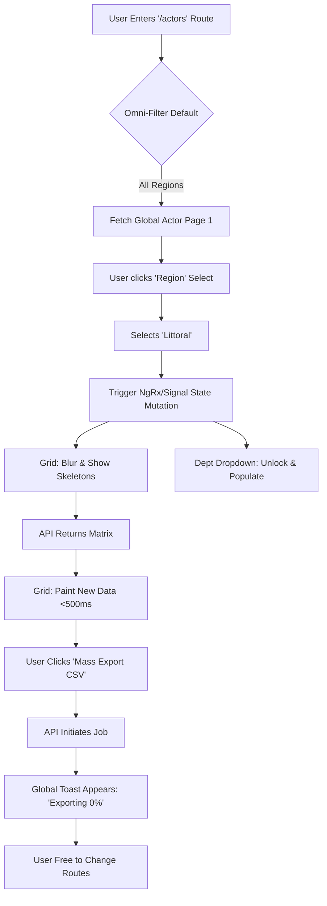
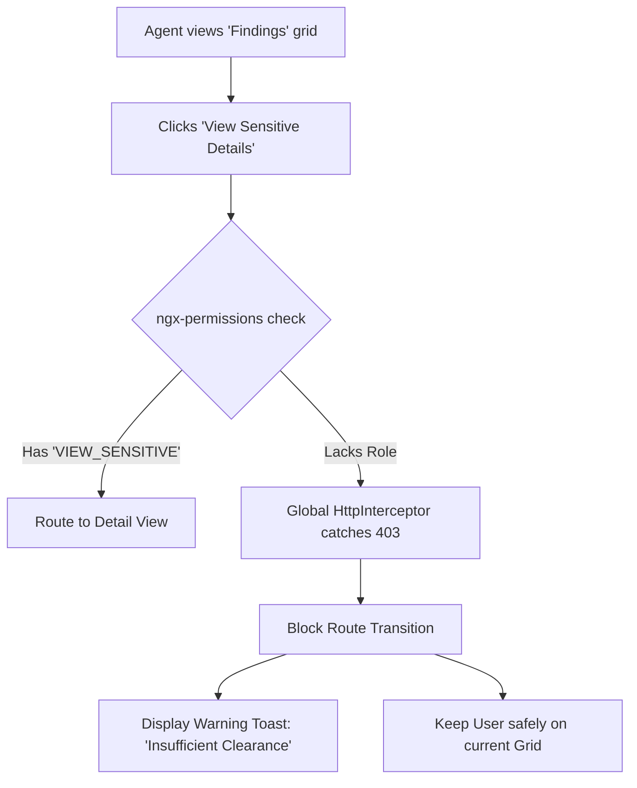

# UX Design Specification LandReg Admin Portal

**Author:** Francis
**Date:** 2026-04-09T15:47:00+04:00

---

<!-- UX design content will be appended sequentially through collaborative workflow steps -->

## Executive Summary

### Project Vision

The LandReg Admin Portal serves as the primary administrative viewing bridge into the land database ecosystem. It marries severe performance requirements (guaranteed sub-500ms transitions) with an elite, premium aesthetic dictated entirely by a custom Vanilla CSS architecture, stripping away boilerplate component libraries to yield a distinct, lightweight data analytics powerhouse. 

### Target Users

Governance officers, System Administrators, and Administrative Agents engaging with massive datasets. They require dense information delivery, reliable asynchronous feedback for heavy operations (like CSV generation), and frictionless geographic drill-down capabilities.

### Key Design Challenges

- **Vanilla CSS Premium Grids:** Building an enterprise-grade, highly accessible, state-rich Data Grid component layout exclusively from raw CSS without leaning on Material/Tailwind paradigms.
- **Cascade Geography Persistence:** Designing a persistent, multi-tiered dropdown UI (Cascade Filter) that informs the user of their current data-scoping filter without dominating the screen real-estate.
- **Non-blocking UX Feedback:** Engineering clear, globally persistent Toast elements that convey the real-time polling state of background exports, preventing user abandonment.

### Design Opportunities

- **Granular Tokenization:** Leveraging raw CSS custom properties to implement highly polished design tokens (Color, Spacing, Typography) natively, allowing for flawless Dark/Light mode thematic switches.
- **Micro-Interaction Polish:** Introducing subtle but lightning-fast native transitions (hover states, modal entrances) enabled by Angular 18's rendering engine to establish a flagship brand identity for the portal.

## Core User Experience

### Defining Experience

The primary interface thrives on Data Density and Query Velocity. Users must be able to explore millions of geographical findings and actor records without ever feeling restricted by the web browser. The system must feel like a dedicated native desktop application, empowering users to execute mass-scale cross-referencing and background exports.

### Platform Strategy

- **Desktop-First Web Portal:** Optimized strictly for widescreen displays (1080p and above).
- **Input Paradigms:** Precision mouse and keyboard navigation. Dense grid rows favor hover states and tight padding over large, mobile-friendly touch targets.
- **Native Browser Capabilities:** Strict reliance on modern CSS Grid and custom properties, completely bypassing UI library overhead.

### Effortless Interactions

- **The Cascade Engine:** Navigating the geographic hierarchy (Region to Arrondissement) must be entirely frictionless. Selections instantly mutate the global state and trigger asynchronous grid re-fetches without any explicit "Submit Query" button.
- **Zero-Friction Exports:** Mass data exportation drops immediately into an HTTP short-polling background thread. A non-obtrusive, globally persistent Toast component handles the tracking, granting the user absolute freedom to change routes.

### Critical Success Moments

- **The Instant Filter:** The system successfully processes a multi-tiered geographic query yielding exact Actor/Finding matrices within 500ms, proving the portal's elite performance parameters.
- **The Export Completion:** A user successfully navigates away from the active grid, continues working, and receives a satisfying, animated "Export Ready: Click to Download" toast overlay.

### Experience Principles

1. **Velocity Above All:** Every interaction is engineered to minimize Time-to-First-Byte (TTFB) and layout shift.
2. **Dense, Not Cluttered:** Maximize information on-screen without overwhelming the cognitive load. Whitespace is a tool for grouping, not just padding.
3. **Respect the Process:** Never block the user. Long running tasks must be explicitly decentralized to background tracking mechanisms.

## Desired Emotional Response

### Primary Emotional Goals

Users should feel an overwhelming sense of **Control, Velocity, and Authority**. The system must project absolute stability, making the manipulation of enormous data pipelines feel completely effortless. It should alleviate the anxiety normally associated with heavy web-based database exploitation.

### Emotional Journey Mapping

- **Entry:** Upon logging in, the user feels *clarity*. The dense visual hierarchy immediately presents the state of the data without clutter.
- **Action:** During geographic filtering, the instantaneous repainting of the Data Grids sparks *confidence*. The system is reacting precisely to their input without latency.
- **Heavy Lifting:** Initiating a mass CSV export yields *relief and trust*, as the background poller immediately detaches the heavy task and allows the user to continue operating fluidly.
- **Completion:** The final asynchronous toast notification delivers *satisfaction*, creating a closed psychological loop of task completion.

### Micro-Emotions

- **Confidence > Confusion:** Driven by explicit UI state cues. When the 'Canton' filter is active, the UI leaves no doubt about the current geographic scope.
- **Trust > Skepticism:** Driven by performance predictability. Every API request must resolve or fail gracefully with clear visual explanations.
- **Accomplishment > Frustration:** Dropping heavy, blocking loading spinners in favor of background tasks radically shifts the user from feeling "blocked" to feeling "productive".

### Design Implications

- *To evoke Authority:* We must utilize a stark, severe color palette (e.g., deep slates, crisp whites, high-contrast borders) instead of playful or generic corporate blues.
- *To evoke Velocity:* Transition times (`transition: all 0.15s ease-in-out;`) must be aggressively short. Hover states on row elements must engage identically to native desktop apps.
- *To evoke Trust:* Error states (e.g., HTTP 403 Forbidden from `ngx-permissions`) cannot just be blank screens or scary red text. They must be handled with elegant, descriptive empty states.

### Emotional Design Principles

1. **Velocity Breeds Trust:** A system that responds instantly is perceived as accurate and secure.
2. **Predictable Feedback:** Silence is the enemy. Every click, from pagination to export, must yield an immediate visual acknowledgement (Toast, Skeleton Loader, Active State).
3. **Professional Seriousness:** The visual language must respect the gravity of government Land Registration data. Aesthetics should skew toward FinTech/Analytics (sharp, precise, dark-mode capable).

## UX Pattern Analysis & Inspiration

### Inspiring Products Analysis

- **Stripe Dashboard:** Mastery of tabular data density. They utilize extremely crisp, small typography (13px-14px) married with subtle zebra-striping and hover states to make reading thousands of rows effortless.
- **Linear:** The gold standard for web-app performance. Their interface entirely eschews heavy loading animations in favor of instant, optimistic UI updates. They treat a web app like a native desktop binary.
- **Vercel Dashboard:** Flawless execution of a stark, developer-centric aesthetic. Heavy use of 1px borders, subtle dark-mode treatments, and aggressive avoidance of "fluffy" UI libraries.

### Transferable UX Patterns

**Navigation/Interaction Patterns:**
- **The Omni-Filter:** From Stripe, we can adopt the concept of keeping the Geographic Cascade permanently affixed above the grid. The state is always visible; the user never has to guess what "Region" they are currently querying.
- **Non-Blocking Toasts:** Borrowing from modern dev-tools, background exports will fire a small, animated notification into the bottom right corner. The user can interact with the rest of the application completely uninterrupted while a progress bar ticks up on the toast.

**Visual Patterns:**
- **Border-Driven Hierarchy:** Instead of relying on heavy drop-shadows (which look dated), we will define hierarchy using crisp, 1px borders (`border-gray-800` in dark mode) and subtle background shifts on hover.

### Anti-Patterns to Avoid

- **The "Material Admin" Bloat:** Absolutely zero massive floating action buttons (FABs), excessive padding, or slow "ripple" animations. They consume screen real-estate and feel sluggish.
- **Blocking Loading Spinners:** Never trap the user behind a full-screen semi-transparent gray overlay while a query runs. Utilize skeleton loaders for grid rows, keeping the rest of the UI interactive.
- **Hidden Filter States:** Avoid tucking the Geographic cascade behind a generic "Filter" icon. If the grid is scoped to a specific 'Canton,' that context must be permanently displayed on-screen.

### Design Inspiration Strategy

**What to Adopt:**
- **Dense Typography:** We will heavily adopt the smaller, highly-legible sans-serif font weights (e.g., Inter or Roboto at 13px base) used by elite FinTech dashboards to maximize grid rows.

**What to Adapt:**
- **The Cascade Interface:** We will adapt standard dropdowns into a horizontal chained-select component (Region -> Dept -> Commune) that visibly maps the user's data-drill-down journey.

**What to Avoid:**
- **Off-the-shelf Theming:** We will aggressively avoid components that look "borrowed" from other websites. The LandReg portal must look and behave like a bespoke intelligence tool.

## Design System Foundation

### 1.1 Design System Choice

**100% Custom Vanilla CSS Design System.** 
We are explicitly rejecting all external component libraries (Angular Material, Ant Design) and all utility-class abstractions (TailwindCSS, Bootstrap).

### Rationale for Selection

- **Absolute Brand Distinguishment:** Leveraging raw CSS allows us to build razor-sharp, dense data grids that simply cannot be achieved when fighting against the heavy specificity rules of pre-built component libraries.
- **Micro-Performance:** By omitting CSS frameworks, we ship zero unused utility classes to the browser. The stylesheet will only contain exactly the rules required, drastically improving parse times and maintaining our 500ms interaction budget.
- **Architectural Enforcement:** `project-context.md` strictly forbids utility classes and mandates Vanilla CSS.

### Implementation Approach

We will engineer a highly tokenized CSS architecture built directly into Angular's `styles.css`:
1. **Design Tokens:** Define all core variables (Color hexes, typography scales, spacing multipliers) explicitly at the `:root` level.
2. **BEM Methodology:** Given the ban on Tailwind, we will adopt a strict Block-Element-Modifier (BEM) naming convention for component-scoped CSS rules to ensure styles never bleed across the Angular component boundaries.
3. **Control Flow Alignment:** Animations and transitions will be mapped directly to Angular 18's new `@if` and `@for` DOM insertion events.

### Customization Strategy

- **Dark Mode First:** We will architect the color tokens to support a primary "Dark Analytics" theme out of the box, with variables structurally prepared to swap to a "Light Mode" cleanly via a `data-theme="light"` body attribute.
- **Granular Grids:** We will define a standard CSS Grid mathematical scale (`display: grid; grid-template-columns: repeat(...)`) that all feature grids will inherit, ensuring global column alignment.

## Defining Experience Mechanics

### 2.1 The Defining Interaction: "The Omni-Filter Cascade"
The core interaction is the seamless, progressively narrowing geographical data query. Users will "funnel" massive datasets down to highly specific geographical nodes (like an Arrondissement) natively, triggering rapid grid repaints and setting up the state for a massive CSV background export.

### 2.2 User Mental Model
Administrators mentally model data locally. They don't want to write SQL or build complex query blocks. They think top-down: "I need all the Actors in the Littoral region, specifically in the Wouri department." Their primary frustration with existing government tools is having to select a filter, click "Search," wait for a page reload, and then repeat the process if they made a mistake. Our interface abandons the "Search Button" entirely in favor of reactive state mutations.

### 2.3 Success Criteria
- **Zero-Click Searching:** Selecting a Region from a dropdown immediately repaints the grid and populates the Department dropdown. No "Submit" button required.
- **Visual Continuity:** Changing a filter must *never* result in a white-screen flash or a full-page reload.
- **Asynchronous Detachment:** Clicking "Export to CSV" must feel instant—giving the user control back in less than 100ms, while a Toast handles the 2-minute polling job invisibly.

### 2.4 Novel UX Patterns
Instead of burying filters in a sidebar or a modal, we are adopting the **Persistent Global Filter Bar**. The Geographic Cascade exists globally at the top of the grid views. Because `@ngrx/signals` manages the global state natively, changing the cascade on the "Actors" page will keep the identical geographic scope active if the user switches to the "Findings" page. This cross-tab state persistence is a highly advanced, delightful pattern for data exploration.

### 2.5 Experience Mechanics
1. **Initiation:** The user navigates to the 'Actors' grid. The Omni-Filter bar sits above the grid, defaulting to 'All Regions'.
2. **Interaction:** The user clicks 'Region' and selects 'Centre'. 
3. **Feedback:** 
   - The grid instantly overlays a subtle blur and skeleton loaders (`transition: 0.15s`). 
   - The 'Department' dropdown unlocks and populates.
   - The data returns in <500ms; the skeleton loaders dissolve. The metadata updates to read: *"Showing 50 of 12,000 Actors in Region: Centre"*.
4. **Completion (Export):** The user clicks the native "Export Data" icon. The button briefly pulses. A Toast slides in from the bottom-right ("Exporting 12,000 Actors... 0%"). The user is entirely free to change regions or click to another page while the Toast tracks the background job.

## Visual Design Foundation

### Color System
We are establishing a "Dark Analytics" palette. It uses deep, cool slates instead of pure blacks to reduce eye strain during extended data exploitation.

- **Background Base:** `--color-bg-base: #0B0F19;` (Deep Slate)
- **Surface Elevation:** `--color-bg-surface: #111827;` (Raised Slate for UI panels/Dropdowns)
- **Border Structural:** `--color-border: #1F2937;` (Clean, crisp 1px dividing lines)
- **Primary Accent:** `--color-primary: #3B82F6;` (Electric Blue - implies velocity and action)
- **Text Primary:** `--color-text-primary: #F9FAFB;` (Off-white for intense readability)
- **Text Muted:** `--color-text-muted: #9CA3AF;` (Silver for metadata and empty states)

### Typography System
- **Font Family:** `Inter`, fallback to system sans-serif (`-apple-system, BlinkMacSystemFont, "Segoe UI", Roboto...`). It provides incredible numeric legibility (tabular lining) essential for coordinate and data tracking.
- **Scale (Dense):**
  - Base Body (Grids): `13px` - Crucial for maximizing rows on screen.
  - Subtext (Metadata/Counts): `11px` - Uppercase, heavy letter-spacing.
  - Section Headers: `16px` - Semi-bold.
- **Line Height:** Tight `1.4` for data grids to prevent excessive vertical expansion.

### Spacing & Layout Foundation
- **4px Base System:** All padding and margins will follow a strict 4px multiplier (4, 8, 12, 16, 24, 32).
- **Extreme Density:** 
  - `padding: 8px 12px` for table cells.
  - `gap: 8px` standard component separation.
- **Layout Alignment:** The application will use a persistent top-header (for the Omni-Filter) and a full-height, flex-grown central `main` container tailored for CSS Grid rendering. No wrapping containers that force horizontal scrollbars unnecessarily.

### Accessibility Considerations
- **WCAG AA Compliance:** The contrast between `--color-text-primary` and `--color-bg-base` far exceeds the 4.5:1 requirement.
- **Focus States:** Because keyboard-first interaction is paramount for power users, every interactive element will receive a distinct Focus Ring (`outline: 2px solid var(--color-primary); outline-offset: 2px;`) overriding the browser defaults.

## Design Direction Decision

### Design Directions Explored
1. **Direction 1: The Command Center** - A horizontal-heavy layout combining the Geographic Cascade directly into the top Header/Toolbar, maximizing edge-to-edge space for tabular grids.
2. **Direction 2: The Tactical Sidebar** - A vertical-heavy layout pinning the Geographic Cascade to a persistent left-hand sidebar.

### Chosen Direction
**Direction 1: The Command Center (Horizontal Top-Bar Omni-Filter).** 
We are proceeding with Direction 1. Given the sheer density of columns expected in LandReg (Actors: ID, First Name, Last Name, Region, Department, Sector, Role; Findings: Lat, Long, Coordinates, Registration Number... etc.), horizontal screen geometry is extremely precious. Squeezing the data grid alongside a permanent filter sidebar would cause premature column compression or horizontal scrolling. 

### Design Rationale
Placing the Omni-Filter horizontally above the grid logically cascades the user's focus downward: "I am viewing the system globally -> I filter Region/Dept -> I view the results below." This creates a pure, top-to-bottom reading pattern that prevents the UI from feeling segmented. 

### Implementation Approach
All pages across the portal will implement a standard layout envelope:
1. `App Header:` Routing Links (Actors, Findings) and User Profile.
2. `Sticky Omni-Filter Toolbar:` A persistent horizontal belt holding the dynamic Geographic `<select>` inputs.
3. `Main Container:` 100% width, flexible height data-grid wrapper preventing overflow bugs.

## User Journey Flows

### 3.1 Geographic Data Exploitation (Filter & Export)
This flow dictates how a governance agent navigates through the macro data down to a micro level and ultimately extracts it asynchronously.

### 3.2 RBAC Graceful Degradation Flow
When an agent attempts to access a geographic tier or a specific actor record that exceeds their `ngx-permissions` clearance, the system must trap the error and degrade elegantly without crashing the Single Page Application.

### Journey Patterns
- **Optimistic UI Updates:** We assume API success for dropdown unlocking. The 'Department' dropdown unlocks the microsecond 'Region' is selected, even while the Grid is waiting for the backend to return exactly which Departments exist. 
- **Non-blocking Escapes:** No action forces the user to a dead-end "Processing..." screen. The Export journey immediately detaches via the Global Toast pattern.

### Flow Optimization Principles
- **Minimize TTFV (Time To First Value):** Default states must always be fully populated. When the user logs in, they immediately see the 'All Regions' global data without executing a single click.
- **Graceful Error Trapping:** Never redirect a user to a terrifying "403 Forbidden" blank page. Bounce the routing attempt silently and show a polite inline or Toast notification.

## Component Strategy

### Design System Components
*Status: Null.* Because we instituted a strict "Vanilla CSS Only" architectural mandate to maximize velocity and enforce the brand visual identity, we are bypassing established design systems (Angular Material, Bootstrap, Tailwind UI). Every component will be engineered natively within the Angular workspace using CSS Custom Properties.

### Custom Components

#### 1. Custom Data Grid (`<app-data-grid>`)
- **Purpose:** Render massive tabular datasets.
- **Anatomy:** `<table>`, `<thead>`, `<tbody>`, custom BEM classes handling zebra-stripes, sticky headers, and pagination controls.
- **States:** Default, HoverRow (highlights row with `rgba(255,255,255,0.05)`), Empty Dataset State.
- **Interaction:** Scrollable body with locked headers. Clicking a row triggers local route navigation to a detail view subject to `ngx-permissions` checks.

#### 2. Omni-Filter Cascade (`<app-geo-cascade>`)
- **Purpose:** Serve as the global geographic State controller.
- **Anatomy:** Flexbox container holding 4 sequentially locked `<select>` nodes.
- **States:** Default, Disabled (waiting for parent tier selection), Loading (spinner appending inside the select box while fetching children).

#### 3. Asynchronous Export Toast (`<app-toast-manager>`)
- **Purpose:** Unblock the user during mass CSV data packaging.
- **Anatomy:** Fixed bottom-right `
` overlay.
- **States:** Initializing (Pulse blue), Exporting (Progress bar filler), Ready (Green pulse with download link), Failed (Red pulse with retry action).

### Component Implementation Strategy
- **Token Injection:** All components will rigidly adhere to the `:root` variables established in our Visual Foundation (e.g., `background-color: var(--color-bg-surface);`). No hardcoded HEX values are permitted within component `.css` files.
- **BEM Isolation:** Angular view encapsulation is acceptable, but BEM naming (`.grid__row--active`) is strongly encouraged for readability and future-proofing.

### Implementation Roadmap

**Phase 1 - Core Structural Components**
- *App Header & Layout Shell:* The outer frame defining the grid areas.
- *The Custom Data Grid:* Must be built first to visualize the `Actor` test data.

**Phase 2 - Interactive & State Components**
- *Omni-Filter Cascade:* The logic to parse Regions/Departments and trigger NgRx signals.
- *Skeleton Loaders:* Table row shimmer effects to handle the <500ms grid refetches gracefully.

**Phase 3 - Feedback Components**
- *Toast Manager:* The global service listening to WebSocket or HTTP short-polling events to track export completion.

## UX Consistency Patterns

### Button Hierarchy
We use strict visual hierarchy to prevent interface clutter and direct user attention.
- **Primary Action (Export):** Uses `--color-primary` background with `--color-text-primary` text. No drop shadows. High contrast hover state that slightly brightens the background. Maximum of *one* primary button visible per page view.
- **Secondary Action (Filters/Dropdowns):** Transparent background, strictly defined by a 1px `--color-border` outline. Hover state slightly lightens the background (`rgba(255,255,255,0.05)`).
- **Destructive Action:** Uses a muted red token (`#EF4444`). Only used in critical, irreversible state mutations (which are rare in this analytics context).

### Feedback Patterns
Silence is the enemy of a data-dense portal. Every interaction requires feedback.
- **Async Tasks (Exports):** Pushed to the global `<app-toast-manager>`. Toasts stack in the bottom-right and never block the center of the screen.
- **Data Loading:** When fetching data grids, the existing data stays on screen but slightly fades opacity while `skeleton-row` animations overlay on top. This prevents violent page-reflows.
- **Empty States:** A grid returning zero results never shows a blank table. It injects a highly legible row spanning all columns stating exactly why it's empty (e.g., "No Actors found in Douala 1. Try adjusting your geographic filter.")

### Form Patterns
- **Input Styling:** Given the dark-mode aesthetic, inputs use `--color-bg-base` with a 1px `--color-border`. They do *not* use floating labels. Labels are positioned crisply above the input (`11px` uppercase muted text).
- **Focus Rings:** Forms rely heavily on the global focus ring (`outline: 2px solid var(--color-primary);`) to guarantee keyboard power-users always know where they are.
- **Validation:** Validation happens instantly on `blur`, not on form submit. Error states turn the input border red and inject a 10px helper text immediately below.

### Navigation Patterns
- **Global Header Routing:** Based on *Direction 1*, all module routing (Actors vs. Findings) happens in the top-left of the application header.
- **Active States:** The currently active route receives a bold, illuminated bottom-border. Inactive links are aggressively muted (`--color-text-muted`) so the eye is drawn down toward the Omni-Filter toolbar instead of the global navigation.
- **No Sidebars:** We explicitly avoid off-canvas menus or sticky left sidebars to preserve maximum horizontal width for tabular data.

## Responsive Design & Accessibility

### Responsive Strategy
The LandReg Admin Portal is strictly a **Desktop-First** application optimized for widescreen monitors (`1920x1080` and up).
- **Desktop Strategy:** Leverage CSS Grid to allocate massive horizontal real-estate to the `app-data-grid`. The UI will dynamically expand to fill 4K monitors without arbitrary max-width boxing.
- **Tablet Strategy (Landscape):** On screens `< 1280px`, the data grid columns will cease responsive shrinking and shift to horizontal scrolling (`overflow-x: auto`), utilizing `position: sticky` on the first column (e.g., 'Actor ID') to maintain row context.
- **Mobile Strategy:** Mobile devices (`< 768px`) are entirely unsupported for data exploitation. Attempting to view the grid on a mobile device will trigger an interstitial warning requesting a desktop environment. 

### Breakpoint Strategy
Because we are restricting narrow viewports, we only enforce three primary CSS Media queries:
- `--bp-mobile-block: 768px;` (Fires the unsupported warning)
- `--bp-tablet-scroll: 1024px;` (Triggers horizontal scrolling on grids)
- `--bp-widescreen: 1600px;` (Expands column CSS variables for ultra-wide displays)

### Accessibility Strategy
As a government-affiliated governance tool, **WCAG AA Compliance** is a hard requirement.
- **Contrast:** The specific "Dark Analytics" palette (`#0B0F19` background vs `#F9FAFB` text) has been pre-validated to exceed 4.5:1 ratio requirements.
- **Keyboard Navigation:** Every component must be reachable via the `Tab` key. Custom components like the Omni-Filter must bind to native browser keyboard events (`ArrowUp`, `ArrowDown`, `Enter`) to change selections without a mouse.
- **Screen Readers:** Grid rows must implement `aria-label` tags concatenating the primary data points (e.g., `<tr aria-label="Actor Jean-Baptiste, Inspector in Douala 1">`) rather than forcing the reader to tab through 15 individual `<td>` cells.

### Testing Strategy
- **Automated:** We will integrate `axe-core` checks inside the Angular testing suite to catch contrast or ARIA violations dynamically before PRs are merged.
- **Manual Verification:** Developers must regularly test the application with their mouse unplugged to verify the "Keyboard Power-User" routing flow remains unbroken.

### Implementation Guidelines
- **Global Typography Scale:** Use `rem` for typography. If an accessible user overrides their browser default font-size (16px -> 24px), our `0.8125rem` (13px) tabular data should scale proportionally without breaking the layout.
- **Interactive Toggles:** Custom components cannot rely on `
` elements with `(click)` bounds. They must use native `<button>` or `<input>` elements or explicitly define `role="button"` and `tabindex="0"`.
