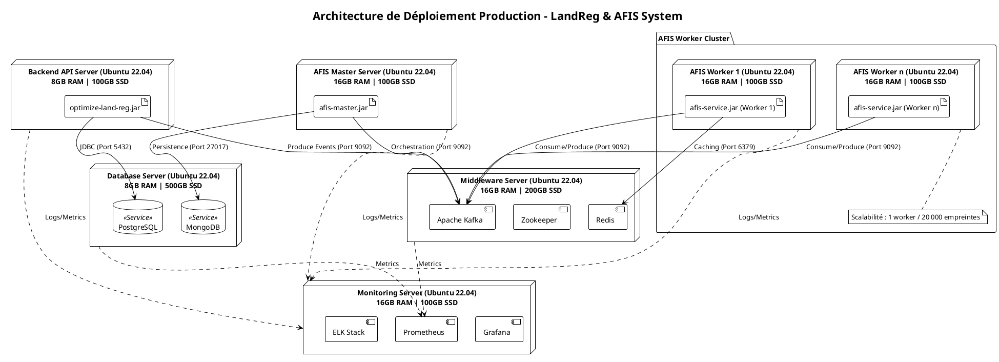

### Architecture de Déploiement

L'architecture est segmentée en couches pour assurer la haute disponibilité et la scalabilité horizontale des services AFIS.

1. **Couche Données (Database Server)** : Centralise les persistances relationnelles (PostgreSQL) pour la gestion foncière et documentaires (MongoDB) pour les métadonnées biométriques.
2. **Couche API (Application Server API)** : Héberge l'entrée principale du système `optimize-land-reg`.
3. **Couche AFIS (Master & Workers)** :
* Le **Master** orchestre les tâches de comparaison.
* Les **Workers** (`afis-service`) sont dimensionnés selon votre règle (1 worker par tranche de 20 000 empreintes) pour garantir les performances de matching.

4. **Couche Middleware (Message Broker & Cache)** : Assure la communication asynchrone via Kafka et le cache rapide via Redis.
5. **Couche Observabilité (Monitoring)** : Centralise les métriques et les logs de l'ensemble du cluster.

---

### Diagramme de Déploiement (PlantUML)

---

### Détails Techniques des Serveurs (Ubuntu 22.04+)

#### 1. Database Server (8GB RAM, 500GB SSD)

* **Rôle** : Stockage persistant.
* **Services** :
* `PostgreSQL 14+` : Utilisé par `optimize-land-reg` pour les données métier.
* `MongoDB 5.0+` : Utilisé par `afis-master` pour le stockage des `FingerprintStore`.

* **Optimisation** : Configuration du `max_connections` pour Postgres et indexation sur les champs `name` et `phone` pour les acteurs.

#### 2. Backend API Server (8GB RAM, 100GB SSD)

* **Rôle** : API REST et point d'entrée.
* **Logiciel** : `optimize-land-reg` (Spring Boot).
* **Communication** : Client Feign vers `afis-master` et producteur Kafka pour les tâches asynchrones.

#### 3. AFIS Master Server (16GB RAM, 100GB SSD)

* **Rôle** : Gestionnaire central de la biométrie.
* **Logiciel** : `afis-master` (Spring Boot).
* **Flux** : Reçoit les demandes de matching, gère l'historique (`MatcherJobHistory`) et distribue via Kafka.

#### 4. AFIS Service Workers (16GB RAM, 100GB SSD par serveur)

* **Rôle** : Unités de calcul intensif pour le matching.
* **Dimensionnement** : $N = \lceil \text{Nombre d'empreintes} / 20000 \rceil$.
* **Logiciel** : `afis-service`.
* **Spécificité** : Utilise Redis pour optimiser les recherches fréquentes et Kafka pour la consommation des jobs.

#### 5. Middleware Server (16GB RAM, 200GB SSD)

* **Rôle** : Transport de données et coordination.
* **Services** :
* `Kafka` & `Zookeeper` : Bus d'événements pour le découplage API/Master/Workers.
* `Redis` : Cache distribué pour les workers.

#### 6. Monitoring Server (16GB RAM, 100GB SSD)

* **Rôle** : Surveillance et alertes.
* **Outils** :
* `Prometheus` : Collecte les métriques JMX via les endpoints Actuator des services Spring Boot.
* `Grafana` : Tableaux de bord pour la JVM et le débit Kafka.
* `ELK (Elasticsearch, Logstash, Kibana)` : Centralisation des logs applicatifs.
